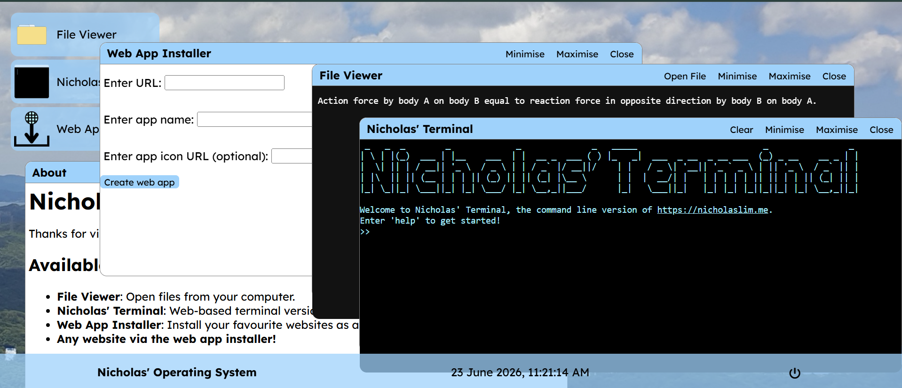

# Nicholas' OS
My personal web-based operating system made with HTML, CSS and vanilla JS!

## Applications
 - File Viewer: View files from your computer.
 - Terminal: A web app of my <a href="https://nicholaslim.me/terminal/">web-based terminal</a>.
 - Web App Installer: Install any website that allows embedding as a web app.

## Features
 - Bottom panel with a system clock and power off button to exit the OS.
 - Websites without Progressive Web App files can also be used like native apps.
 - Draggable windows with minimise, maximise and close functions.
